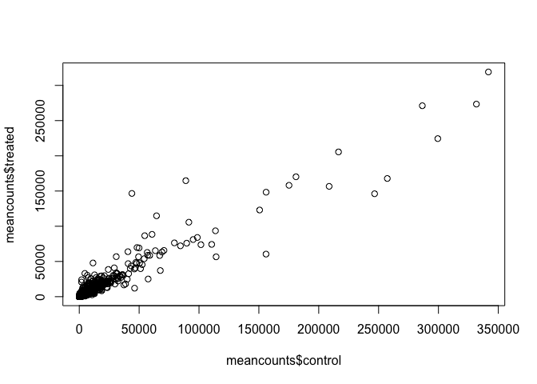
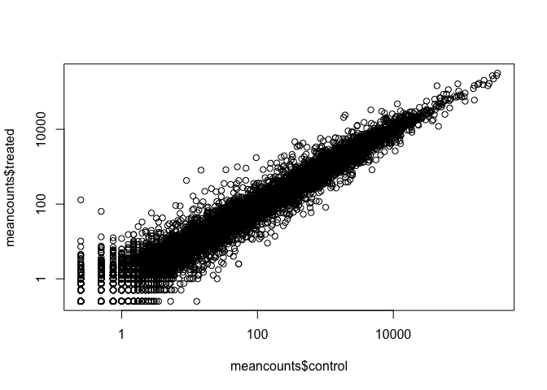
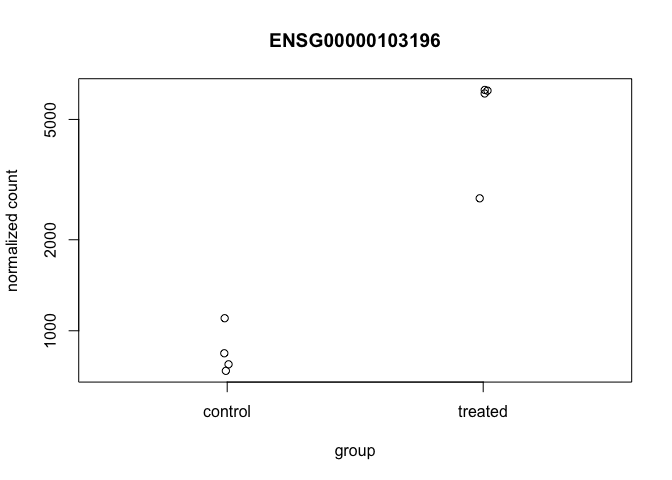
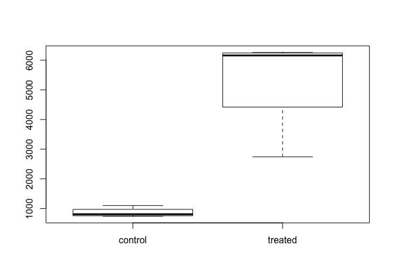
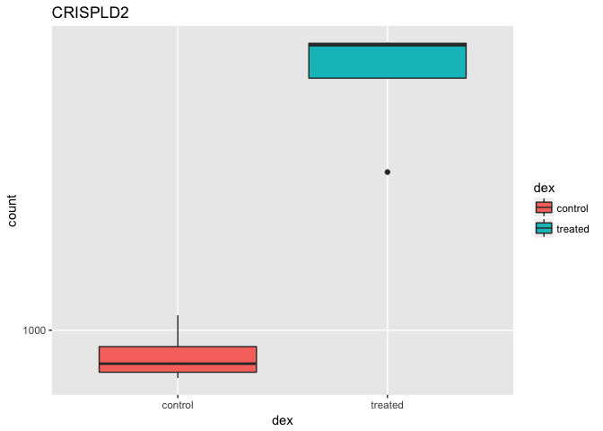
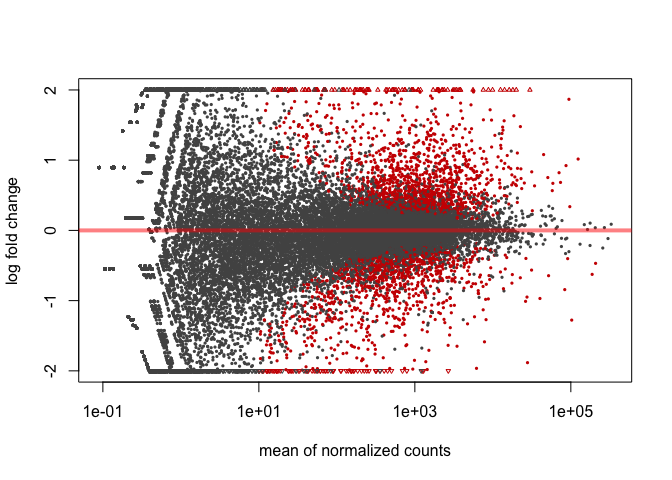
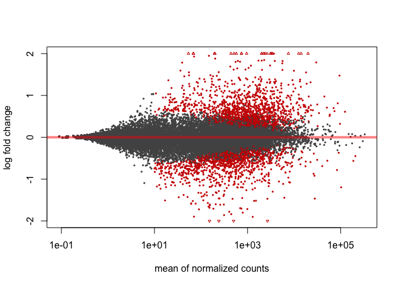
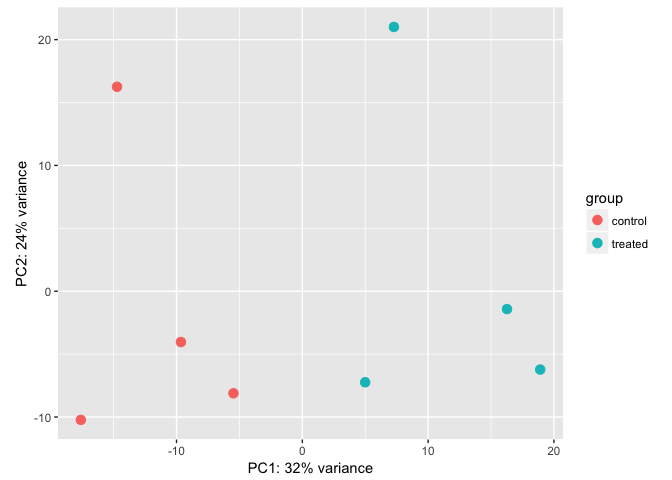

Class14
================

Analysis of RNAseq data
-----------------------

Input our data

``` r
metadata <- read.csv("data/airway_metadata.csv", stringsAsFactors = FALSE)
counts <- read.csv("data/airway_scaledcounts.csv", stringsAsFactors= FALSE)
```

``` r
colnames(counts)[-1] == metadata$id
```

    ## [1] TRUE TRUE TRUE TRUE TRUE TRUE TRUE TRUE

Calculate the mean counts for each gene accross all control experiments
=======================================================================

``` r
control <- metadata[metadata[,"dex"]=="control",]
control.mean <- rowSums( counts[ ,control$id] )/nrow(control) 
names(control.mean) <- counts$ensgene
```

``` r
head(control.mean)
```

    ## ENSG00000000003 ENSG00000000005 ENSG00000000419 ENSG00000000457 
    ##          900.75            0.00          520.50          339.75 
    ## ENSG00000000460 ENSG00000000938 
    ##           97.25            0.75

Calculate the mean counts for each gene accross all drug treated experiments
============================================================================

``` r
treated <- metadata[metadata[,"dex"]=="treated",]
treated.mean <- rowSums( counts[ ,treated$id] )/nrow(treated) 
names(treated.mean) <- counts$ensgene
```

``` r
head(treated.mean)
```

    ## ENSG00000000003 ENSG00000000005 ENSG00000000419 ENSG00000000457 
    ##          658.00            0.00          546.00          316.50 
    ## ENSG00000000460 ENSG00000000938 
    ##           78.75            0.00

Combine into a new data.frame
=============================

``` r
meancounts <- data.frame(control.mean, treated.mean)
head(meancounts)
```

    ##                 control.mean treated.mean
    ## ENSG00000000003       900.75       658.00
    ## ENSG00000000005         0.00         0.00
    ## ENSG00000000419       520.50       546.00
    ## ENSG00000000457       339.75       316.50
    ## ENSG00000000460        97.25        78.75
    ## ENSG00000000938         0.75         0.00

``` r
colSums(meancounts)
```

    ## control.mean treated.mean 
    ##     23005324     22196524

Plot our mean counts data for control vs treated
================================================

``` r
plot(meancounts$control, meancounts$treated)
```



``` r
plot
```

    ## function (x, y, ...) 
    ## UseMethod("plot")
    ## <bytecode: 0x7ff9afa977b8>
    ## <environment: namespace:graphics>

Plot with log axis
==================

``` r
plot(meancounts$control, meancounts$treated,log="xy")
```

    ## Warning in xy.coords(x, y, xlabel, ylabel, log): 15032 x values <= 0
    ## omitted from logarithmic plot

    ## Warning in xy.coords(x, y, xlabel, ylabel, log): 15281 y values <= 0
    ## omitted from logarithmic plot



``` r
plot
```

    ## function (x, y, ...) 
    ## UseMethod("plot")
    ## <bytecode: 0x7ff9afa977b8>
    ## <environment: namespace:graphics>

calculate log2foldchange
========================

``` r
meancounts$log2fc <- log2(meancounts[,"treated.mean"]/meancounts[,"control.mean"])
head(meancounts)
```

    ##                 control.mean treated.mean      log2fc
    ## ENSG00000000003       900.75       658.00 -0.45303916
    ## ENSG00000000005         0.00         0.00         NaN
    ## ENSG00000000419       520.50       546.00  0.06900279
    ## ENSG00000000457       339.75       316.50 -0.10226805
    ## ENSG00000000460        97.25        78.75 -0.30441833
    ## ENSG00000000938         0.75         0.00        -Inf

It turns out that there are a lot of genes with zero expression. Let’s filter our data to remove these genes.
=============================================================================================================

How to find zero value in a matrix
==================================

``` r
x <- matrix(1:10, ncol=2, byrow=TRUE)
x[5,2] <- 0
which(x==0, arr.ind=TRUE)
```

    ##      row col
    ## [1,]   5   2

find zero value in our matrix counts
====================================

``` r
zero.vals <- which(meancounts[,1:2]==0, arr.ind=TRUE)
head(zero.vals)
```

    ##                 row col
    ## ENSG00000000005   2   1
    ## ENSG00000004848  65   1
    ## ENSG00000004948  70   1
    ## ENSG00000005001  73   1
    ## ENSG00000006059 121   1
    ## ENSG00000006071 123   1

Now remove the zero count containing genes
==========================================

``` r
to.rm <- unique(zero.vals[,1])
mycounts <- meancounts[-to.rm,]
head(mycounts)
```

    ##                 control.mean treated.mean      log2fc
    ## ENSG00000000003       900.75       658.00 -0.45303916
    ## ENSG00000000419       520.50       546.00  0.06900279
    ## ENSG00000000457       339.75       316.50 -0.10226805
    ## ENSG00000000460        97.25        78.75 -0.30441833
    ## ENSG00000000971      5219.00      6687.50  0.35769358
    ## ENSG00000001036      2327.00      1785.75 -0.38194109

Let’s filter the dataset both ways to see how many genes are up or down-regulated. A common threshold used for calling something differentially expressed is a log2(FoldChange) of greater than 2 or less than -2
=================================================================================================================================================================================================================

``` r
up.ind <- mycounts$log2fc > 2
down.ind <- mycounts$log2fc < (-2)
```

``` r
head(up.ind)
```

    ## [1] FALSE FALSE FALSE FALSE FALSE FALSE

``` r
sum(up.ind)
```

    ## [1] 250

``` r
sum(down.ind)
```

    ## [1] 367

``` r
paste("Up:", sum(up.ind))
```

    ## [1] "Up: 250"

``` r
paste("Down:", sum(down.ind))
```

    ## [1] "Down: 367"

Add annotation from a supplied CSV file, such as those available from ENSEMBLE or UCSC
======================================================================================

``` r
anno <- read.csv("data/annotables_grch38.csv")
head(anno)
```

    ##           ensgene entrez   symbol chr     start       end strand
    ## 1 ENSG00000000003   7105   TSPAN6   X 100627109 100639991     -1
    ## 2 ENSG00000000005  64102     TNMD   X 100584802 100599885      1
    ## 3 ENSG00000000419   8813     DPM1  20  50934867  50958555     -1
    ## 4 ENSG00000000457  57147    SCYL3   1 169849631 169894267     -1
    ## 5 ENSG00000000460  55732 C1orf112   1 169662007 169854080      1
    ## 6 ENSG00000000938   2268      FGR   1  27612064  27635277     -1
    ##          biotype
    ## 1 protein_coding
    ## 2 protein_coding
    ## 3 protein_coding
    ## 4 protein_coding
    ## 5 protein_coding
    ## 6 protein_coding
    ##                                                                                                  description
    ## 1                                                          tetraspanin 6 [Source:HGNC Symbol;Acc:HGNC:11858]
    ## 2                                                            tenomodulin [Source:HGNC Symbol;Acc:HGNC:17757]
    ## 3 dolichyl-phosphate mannosyltransferase polypeptide 1, catalytic subunit [Source:HGNC Symbol;Acc:HGNC:3005]
    ## 4                                               SCY1-like, kinase-like 3 [Source:HGNC Symbol;Acc:HGNC:19285]
    ## 5                                    chromosome 1 open reading frame 112 [Source:HGNC Symbol;Acc:HGNC:25565]
    ## 6                          FGR proto-oncogene, Src family tyrosine kinase [Source:HGNC Symbol;Acc:HGNC:3697]

Use the *merge()* function
==========================

results &lt;- merge(mycounts, anno, by.x=??, by.y=??)
=====================================================

``` r
results <- merge(mycounts, anno, by.x="row.names", by.y="ensgene")
head(results)
```

    ##         Row.names control.mean treated.mean      log2fc entrez   symbol
    ## 1 ENSG00000000003       900.75       658.00 -0.45303916   7105   TSPAN6
    ## 2 ENSG00000000419       520.50       546.00  0.06900279   8813     DPM1
    ## 3 ENSG00000000457       339.75       316.50 -0.10226805  57147    SCYL3
    ## 4 ENSG00000000460        97.25        78.75 -0.30441833  55732 C1orf112
    ## 5 ENSG00000000971      5219.00      6687.50  0.35769358   3075      CFH
    ## 6 ENSG00000001036      2327.00      1785.75 -0.38194109   2519    FUCA2
    ##   chr     start       end strand        biotype
    ## 1   X 100627109 100639991     -1 protein_coding
    ## 2  20  50934867  50958555     -1 protein_coding
    ## 3   1 169849631 169894267     -1 protein_coding
    ## 4   1 169662007 169854080      1 protein_coding
    ## 5   1 196651878 196747504      1 protein_coding
    ## 6   6 143494811 143511690     -1 protein_coding
    ##                                                                                                  description
    ## 1                                                          tetraspanin 6 [Source:HGNC Symbol;Acc:HGNC:11858]
    ## 2 dolichyl-phosphate mannosyltransferase polypeptide 1, catalytic subunit [Source:HGNC Symbol;Acc:HGNC:3005]
    ## 3                                               SCY1-like, kinase-like 3 [Source:HGNC Symbol;Acc:HGNC:19285]
    ## 4                                    chromosome 1 open reading frame 112 [Source:HGNC Symbol;Acc:HGNC:25565]
    ## 5                                                     complement factor H [Source:HGNC Symbol;Acc:HGNC:4883]
    ## 6                                          fucosidase, alpha-L- 2, plasma [Source:HGNC Symbol;Acc:HGNC:4008]

DESeq2 analysis
===============

Set up ourDESeq Data Set

``` r
library(DESeq2)
```

    ## Loading required package: S4Vectors

    ## Loading required package: stats4

    ## Loading required package: BiocGenerics

    ## Loading required package: parallel

    ## 
    ## Attaching package: 'BiocGenerics'

    ## The following objects are masked from 'package:parallel':
    ## 
    ##     clusterApply, clusterApplyLB, clusterCall, clusterEvalQ,
    ##     clusterExport, clusterMap, parApply, parCapply, parLapply,
    ##     parLapplyLB, parRapply, parSapply, parSapplyLB

    ## The following objects are masked from 'package:stats':
    ## 
    ##     IQR, mad, sd, var, xtabs

    ## The following objects are masked from 'package:base':
    ## 
    ##     Filter, Find, Map, Position, Reduce, anyDuplicated, append,
    ##     as.data.frame, cbind, colMeans, colSums, colnames, do.call,
    ##     duplicated, eval, evalq, get, grep, grepl, intersect,
    ##     is.unsorted, lapply, lengths, mapply, match, mget, order,
    ##     paste, pmax, pmax.int, pmin, pmin.int, rank, rbind, rowMeans,
    ##     rowSums, rownames, sapply, setdiff, sort, table, tapply,
    ##     union, unique, unsplit, which, which.max, which.min

    ## 
    ## Attaching package: 'S4Vectors'

    ## The following object is masked from 'package:base':
    ## 
    ##     expand.grid

    ## Loading required package: IRanges

    ## Loading required package: GenomicRanges

    ## Loading required package: GenomeInfoDb

    ## Loading required package: SummarizedExperiment

    ## Loading required package: Biobase

    ## Welcome to Bioconductor
    ## 
    ##     Vignettes contain introductory material; view with
    ##     'browseVignettes()'. To cite Bioconductor, see
    ##     'citation("Biobase")', and for packages 'citation("pkgname")'.

    ## Loading required package: DelayedArray

    ## Loading required package: matrixStats

    ## 
    ## Attaching package: 'matrixStats'

    ## The following objects are masked from 'package:Biobase':
    ## 
    ##     anyMissing, rowMedians

    ## 
    ## Attaching package: 'DelayedArray'

    ## The following objects are masked from 'package:matrixStats':
    ## 
    ##     colMaxs, colMins, colRanges, rowMaxs, rowMins, rowRanges

    ## The following object is masked from 'package:base':
    ## 
    ##     apply

``` r
citation("DESeq2")
```

    ## 
    ##   Love, M.I., Huber, W., Anders, S. Moderated estimation of fold
    ##   change and dispersion for RNA-seq data with DESeq2 Genome
    ##   Biology 15(12):550 (2014)
    ## 
    ## A BibTeX entry for LaTeX users is
    ## 
    ##   @Article{,
    ##     title = {Moderated estimation of fold change and dispersion for RNA-seq data with DESeq2},
    ##     author = {Michael I. Love and Wolfgang Huber and Simon Anders},
    ##     year = {2014},
    ##     journal = {Genome Biology},
    ##     doi = {10.1186/s13059-014-0550-8},
    ##     volume = {15},
    ##     issue = {12},
    ##     pages = {550},
    ##   }

add

``` r
dds <- DESeqDataSetFromMatrix(countData=counts, 
                              colData=metadata, 
                              design=~dex, 
                              tidy=TRUE)
```

    ## converting counts to integer mode

    ## Warning in DESeqDataSet(se, design = design, ignoreRank): some variables in
    ## design formula are characters, converting to factors

``` r
dds
```

    ## class: DESeqDataSet 
    ## dim: 38694 8 
    ## metadata(1): version
    ## assays(1): counts
    ## rownames(38694): ENSG00000000003 ENSG00000000005 ...
    ##   ENSG00000283120 ENSG00000283123
    ## rowData names(0):
    ## colnames(8): SRR1039508 SRR1039509 ... SRR1039520 SRR1039521
    ## colData names(4): id dex celltype geo_id

``` r
dds <- DESeq(dds)
```

    ## estimating size factors

    ## estimating dispersions

    ## gene-wise dispersion estimates

    ## mean-dispersion relationship

    ## final dispersion estimates

    ## fitting model and testing

``` r
res <- results(dds)
res
```

    ## log2 fold change (MLE): dex treated vs control 
    ## Wald test p-value: dex treated vs control 
    ## DataFrame with 38694 rows and 6 columns
    ##                  baseMean log2FoldChange     lfcSE       stat     pvalue
    ##                 <numeric>      <numeric> <numeric>  <numeric>  <numeric>
    ## ENSG00000000003 747.19420    -0.35070283 0.1682342 -2.0846111 0.03710462
    ## ENSG00000000005   0.00000             NA        NA         NA         NA
    ## ENSG00000000419 520.13416     0.20610652 0.1010134  2.0403876 0.04131173
    ## ENSG00000000457 322.66484     0.02452714 0.1451103  0.1690242 0.86577762
    ## ENSG00000000460  87.68263    -0.14714409 0.2569657 -0.5726216 0.56690095
    ## ...                   ...            ...       ...        ...        ...
    ## ENSG00000283115  0.000000             NA        NA         NA         NA
    ## ENSG00000283116  0.000000             NA        NA         NA         NA
    ## ENSG00000283119  0.000000             NA        NA         NA         NA
    ## ENSG00000283120  0.974916     -0.6682308  1.694063 -0.3944544  0.6932456
    ## ENSG00000283123  0.000000             NA        NA         NA         NA
    ##                      padj
    ##                 <numeric>
    ## ENSG00000000003 0.1630257
    ## ENSG00000000005        NA
    ## ENSG00000000419 0.1757326
    ## ENSG00000000457 0.9616577
    ## ENSG00000000460 0.8157061
    ## ...                   ...
    ## ENSG00000283115        NA
    ## ENSG00000283116        NA
    ## ENSG00000283119        NA
    ## ENSG00000283120        NA
    ## ENSG00000283123        NA

``` r
summary(res)
```

    ## 
    ## out of 25258 with nonzero total read count
    ## adjusted p-value < 0.1
    ## LFC > 0 (up)     : 1564, 6.2% 
    ## LFC < 0 (down)   : 1188, 4.7% 
    ## outliers [1]     : 142, 0.56% 
    ## low counts [2]   : 9971, 39% 
    ## (mean count < 10)
    ## [1] see 'cooksCutoff' argument of ?results
    ## [2] see 'independentFiltering' argument of ?results

``` r
resOrdered <- res[order(res$pvalue),]
```

``` r
res05 <- results(dds, alpha=0.05)
summary(res05)
```

    ## 
    ## out of 25258 with nonzero total read count
    ## adjusted p-value < 0.05
    ## LFC > 0 (up)     : 1237, 4.9% 
    ## LFC < 0 (down)   : 933, 3.7% 
    ## outliers [1]     : 142, 0.56% 
    ## low counts [2]   : 9033, 36% 
    ## (mean count < 6)
    ## [1] see 'cooksCutoff' argument of ?results
    ## [2] see 'independentFiltering' argument of ?results

``` r
resSig01 <- subset(as.data.frame(res), padj < 0.01)
nrow(resSig01)
```

    ## [1] 1437

``` r
library("AnnotationDbi")
library("org.Hs.eg.db")
```

    ## 

``` r
resSig01$symbol <- mapIds(org.Hs.eg.db,
                     keys=row.names(resSig01),
                     column="SYMBOL",
                     keytype="ENSEMBL",
                     multiVals="first")
```

    ## 'select()' returned 1:many mapping between keys and columns

``` r
head(resSig01)
```

    ##                  baseMean log2FoldChange      lfcSE      stat       pvalue
    ## ENSG00000002834 8609.1828      0.4168750 0.10827683  3.850085 1.180767e-04
    ## ENSG00000003096  414.0753     -0.9645789 0.19172945 -5.030937 4.880878e-07
    ## ENSG00000003402 3368.7234      1.1624996 0.12612244  9.217230 3.048738e-20
    ## ENSG00000004059 1684.3218      0.3796901 0.11417088  3.325630 8.821899e-04
    ## ENSG00000004487 1255.8003     -0.3341069 0.09600563 -3.480076 5.012723e-04
    ## ENSG00000004700 1510.2085      0.4095532 0.11914030  3.437570 5.869579e-04
    ##                         padj symbol
    ## ENSG00000002834 1.824767e-03  LASP1
    ## ENSG00000003096 1.490341e-05 KLHL13
    ## ENSG00000003402 7.859356e-18  CFLAR
    ## ENSG00000004059 9.389154e-03   ARF5
    ## ENSG00000004487 6.006146e-03  KDM1A
    ## ENSG00000004700 6.760059e-03  RECQL

You can arrange and view the results by the adjusted p-value
============================================================

``` r
ord <- order( resSig01$padj )
head(resSig01[ord,])
```

    ##                   baseMean log2FoldChange      lfcSE      stat
    ## ENSG00000152583   954.7709       4.368359 0.23713648  18.42129
    ## ENSG00000179094   743.2527       2.863888 0.17555825  16.31304
    ## ENSG00000116584  2277.9135      -1.034700 0.06505273 -15.90556
    ## ENSG00000189221  2383.7537       3.341544 0.21241508  15.73120
    ## ENSG00000120129  3440.7038       2.965211 0.20370277  14.55656
    ## ENSG00000148175 13493.9204       1.427168 0.10036663  14.21955
    ##                       pvalue         padj  symbol
    ## ENSG00000152583 8.867079e-76 1.342919e-71 SPARCL1
    ## ENSG00000179094 7.972621e-60 6.037267e-56    PER1
    ## ENSG00000116584 5.798513e-57 2.927283e-53 ARHGEF2
    ## ENSG00000189221 9.244206e-56 3.500088e-52    MAOA
    ## ENSG00000120129 5.306416e-48 1.607313e-44   DUSP1
    ## ENSG00000148175 6.929711e-46 1.749175e-42    STOM

``` r
write.csv( resSig01[ord,], file="signif01_results.csv")
```

Data visualization
==================

Plotting counts

``` r
i <- grep("CRISPLD2", resSig01$symbol)
resSig01[i,]
```

    ##                 baseMean log2FoldChange     lfcSE     stat       pvalue
    ## ENSG00000103196 3096.159       2.626034 0.2674705 9.818031 9.416441e-23
    ##                         padj   symbol
    ## ENSG00000103196 3.395524e-20 CRISPLD2

``` r
rownames(resSig01[i,])
```

    ## [1] "ENSG00000103196"

``` r
plotCounts(dds, gene="ENSG00000103196", intgroup="dex")
```



``` r
d <- plotCounts(dds, gene="ENSG00000103196", intgroup="dex", returnData=TRUE)
head(d)
```

    ##                count     dex
    ## SRR1039508  774.5002 control
    ## SRR1039509 6258.7915 treated
    ## SRR1039512 1100.2741 control
    ## SRR1039513 6093.0324 treated
    ## SRR1039516  736.9483 control
    ## SRR1039517 2742.1908 treated

``` r
boxplot(count ~ dex , data=d)
```



``` r
library(ggplot2)
ggplot(d, aes(dex, count)) + geom_boxplot(aes(fill=dex)) + scale_y_log10() + ggtitle("CRISPLD2")
```

 \#Let’s make some other commonly produced visualizations from this data.

``` r
res$sig <- res$padj<0.05
table(res$sig)
```

    ## 
    ## FALSE  TRUE 
    ## 12963  2182

``` r
sum(is.na(res$sig))
```

    ## [1] 23549

``` r
plotMA(res, ylim=c(-2,2))
```



``` r
resLFC <- lfcShrink(dds, coef=2)
resLFC
```

    ## log2 fold change (MAP): dex treated vs control 
    ## Wald test p-value: dex treated vs control 
    ## DataFrame with 38694 rows and 6 columns
    ##                  baseMean log2FoldChange      lfcSE       stat     pvalue
    ##                 <numeric>      <numeric>  <numeric>  <numeric>  <numeric>
    ## ENSG00000000003 747.19420    -0.31838595 0.15271739 -2.0846111 0.03710462
    ## ENSG00000000005   0.00000             NA         NA         NA         NA
    ## ENSG00000000419 520.13416     0.19883048 0.09744556  2.0403876 0.04131173
    ## ENSG00000000457 322.66484     0.02280238 0.13491699  0.1690242 0.86577762
    ## ENSG00000000460  87.68263    -0.11887370 0.20772938 -0.5726216 0.56690095
    ## ...                   ...            ...        ...        ...        ...
    ## ENSG00000283115  0.000000             NA         NA         NA         NA
    ## ENSG00000283116  0.000000             NA         NA         NA         NA
    ## ENSG00000283119  0.000000             NA         NA         NA         NA
    ## ENSG00000283120  0.974916    -0.05944174  0.1514839 -0.3944544  0.6932456
    ## ENSG00000283123  0.000000             NA         NA         NA         NA
    ##                      padj
    ##                 <numeric>
    ## ENSG00000000003 0.1630257
    ## ENSG00000000005        NA
    ## ENSG00000000419 0.1757326
    ## ENSG00000000457 0.9616577
    ## ENSG00000000460 0.8157061
    ## ...                   ...
    ## ENSG00000283115        NA
    ## ENSG00000283116        NA
    ## ENSG00000283119        NA
    ## ENSG00000283120        NA
    ## ENSG00000283123        NA

``` r
plotMA(resLFC, ylim=c(-2,2))
```



``` r
ggplot(as.data.frame(res), aes(log2FoldChange, -1*log10(pvalue), col=sig)) + 
    geom_point() + 
    ggtitle("Volcano plot")
```

    ## Warning: Removed 13578 rows containing missing values (geom_point).

 \#Side-note: Transformation

``` r
vsdata <- vst(dds, blind=FALSE)
```

PCA
===

``` r
plotPCA(vsdata, intgroup="dex")
```

 \#\# Session Information The sessionInfo() prints version information about R and any attached packages. It’s a good practice to always run this command at the end of your R session and record it for the sake of reproducibility in the future.

``` r
sessionInfo()
```

    ## R version 3.4.4 (2018-03-15)
    ## Platform: x86_64-apple-darwin15.6.0 (64-bit)
    ## Running under: macOS High Sierra 10.13.4
    ## 
    ## Matrix products: default
    ## BLAS: /Library/Frameworks/R.framework/Versions/3.4/Resources/lib/libRblas.0.dylib
    ## LAPACK: /Library/Frameworks/R.framework/Versions/3.4/Resources/lib/libRlapack.dylib
    ## 
    ## locale:
    ## [1] C
    ## 
    ## attached base packages:
    ## [1] parallel  stats4    stats     graphics  grDevices utils     datasets 
    ## [8] methods   base     
    ## 
    ## other attached packages:
    ##  [1] ggplot2_2.2.1              org.Hs.eg.db_3.5.0        
    ##  [3] AnnotationDbi_1.40.0       DESeq2_1.18.1             
    ##  [5] SummarizedExperiment_1.8.1 DelayedArray_0.4.1        
    ##  [7] matrixStats_0.53.1         Biobase_2.38.0            
    ##  [9] GenomicRanges_1.30.3       GenomeInfoDb_1.14.0       
    ## [11] IRanges_2.12.0             S4Vectors_0.16.0          
    ## [13] BiocGenerics_0.24.0       
    ## 
    ## loaded via a namespace (and not attached):
    ##  [1] locfit_1.5-9.1         Rcpp_0.12.16           lattice_0.20-35       
    ##  [4] rprojroot_1.3-2        digest_0.6.15          plyr_1.8.4            
    ##  [7] backports_1.1.2        acepack_1.4.1          RSQLite_2.1.0         
    ## [10] evaluate_0.10.1        pillar_1.2.1           zlibbioc_1.24.0       
    ## [13] rlang_0.2.0            lazyeval_0.2.1         rstudioapi_0.7        
    ## [16] data.table_1.10.4-3    annotate_1.56.2        blob_1.1.1            
    ## [19] rpart_4.1-13           Matrix_1.2-14          checkmate_1.8.5       
    ## [22] rmarkdown_1.9          labeling_0.3           splines_3.4.4         
    ## [25] BiocParallel_1.12.0    geneplotter_1.56.0     stringr_1.3.0         
    ## [28] foreign_0.8-69         htmlwidgets_1.2        RCurl_1.95-4.10       
    ## [31] bit_1.1-12             munsell_0.4.3          compiler_3.4.4        
    ## [34] pkgconfig_2.0.1        base64enc_0.1-3        htmltools_0.3.6       
    ## [37] nnet_7.3-12            tibble_1.4.2           gridExtra_2.3         
    ## [40] htmlTable_1.11.2       GenomeInfoDbData_1.0.0 Hmisc_4.1-1           
    ## [43] XML_3.98-1.11          bitops_1.0-6           grid_3.4.4            
    ## [46] xtable_1.8-2           gtable_0.2.0           DBI_0.8               
    ## [49] magrittr_1.5           scales_0.5.0           stringi_1.1.7         
    ## [52] XVector_0.18.0         genefilter_1.60.0      latticeExtra_0.6-28   
    ## [55] Formula_1.2-3          RColorBrewer_1.1-2     tools_3.4.4           
    ## [58] bit64_0.9-7            survival_2.42-3        yaml_2.1.18           
    ## [61] colorspace_1.3-2       cluster_2.0.7-1        memoise_1.1.0         
    ## [64] knitr_1.20
